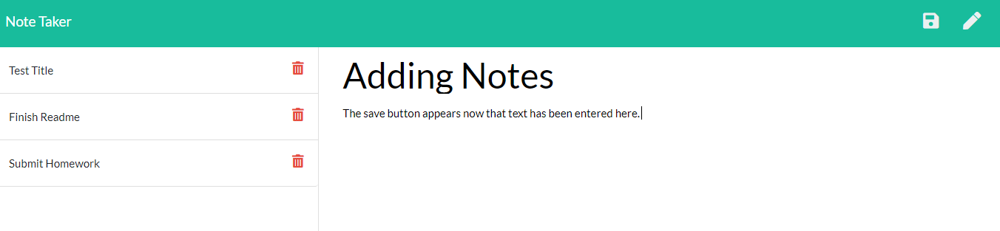
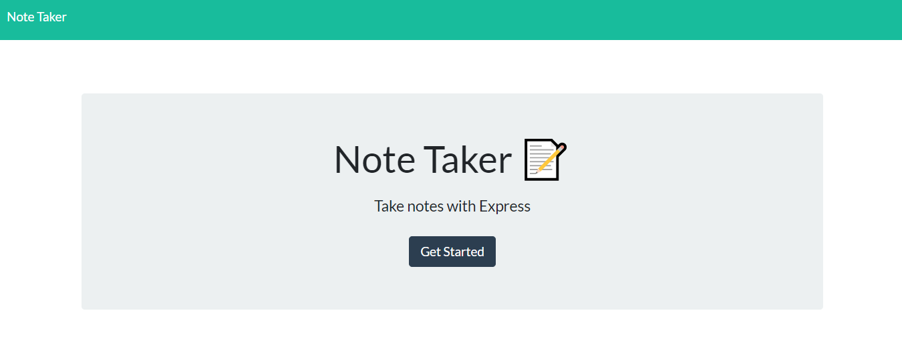

  # Note Taker

  

  ## Description 

  This is an application designed to let the user write, save and delete notes and tasks. To add a new note, click the pencil in the upper right hand corner, or start typing in the black fields on the right hand column. Once the title and text have been entered a save button appears on the upper right hand corner. Once the save button is clicked the note/task is saved and moved to the left hand column. If you want to view any prior note/task you can select it by clicking on it in the right hand column and it will be moved to the left hand columnn for you to view. To remove a note/task once it has been completed, just click on the trash icon next to the note/task in the left hand column. 

  
  
  
  ## Table of Contents
    
  * [Installation](#installation)
  * [Usage](#usage)
  * [License](#license)
  * [Questions](#questions)
  
  
  ## Installation
  
  You can access this application by going to the following website: https://lit-plateau-00164.herokuapp.com/
  
  
  ## Usage 
  
  You can access the website by navigating to the landing page as noted above. Once you are there click on the "Get Started" button and then you can start entering your notes/tasks. 
  

  
  ## License
  
  MIT

  ## Questions
  For questions you can contact me here:
  * GitHub Username: https://github.com/siwel20/
  * email: plthrock@gmail.com
